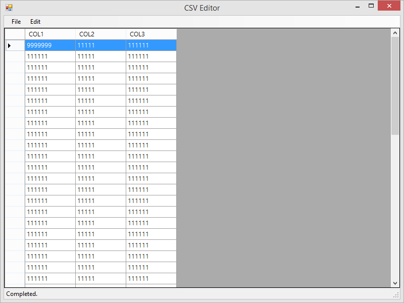

# CsvEditor

Simple Csv File Editor

## CSV
A comma-separated values (CSV) (also sometimes called character-separated values, because the separator character does not have to be a comma) file stores tabular data (numbers and text) in plain-text form. ([wiki:Comma-separated Values](http://en.wikipedia.org/wiki/Comma-separated_values))

Edit your csv file without Microsoft Office Excel ;)

## Requirements
* Microsoft Windows XP +
* .Net Framework 4.0

## Feature
* Edit csv file; Modify, Add, Delete Data.
* Change Columns Order.

## Screenshot

